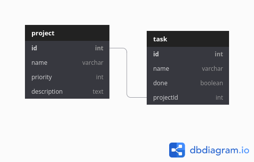

# Node-Sequalize

Sequelize REST API
- nodejs
- express
- postgreSQL
- sequelize
- typescript

## Installation

This command installs a package, and any packages that it depends on. If the package has a package-lock or shrinkwrap file, the installation of dependencies will be driven by that, with an npm-shrinkwrap.json taking precedence if both files exist. See package-lock.json and npm shrinkwrap.

```bash
npm install
```

## Usage

```python
Compilar TS

# compilar 'TS'
npm run tsc

# compilación 'desarrollo'
npm run dev

# compilación 'general'
npm run start
```

## Modeling

This is the basic relationship that we are using in this example



## Contributing
Pull requests are welcome. For major changes, please open an issue first to discuss what you would like to change.

Please make sure to update tests as appropriate.

## License
[MIT](https://choosealicense.com/licenses/mit/)